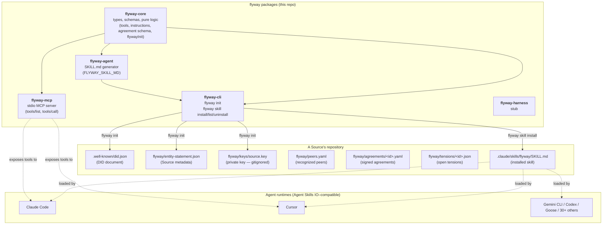
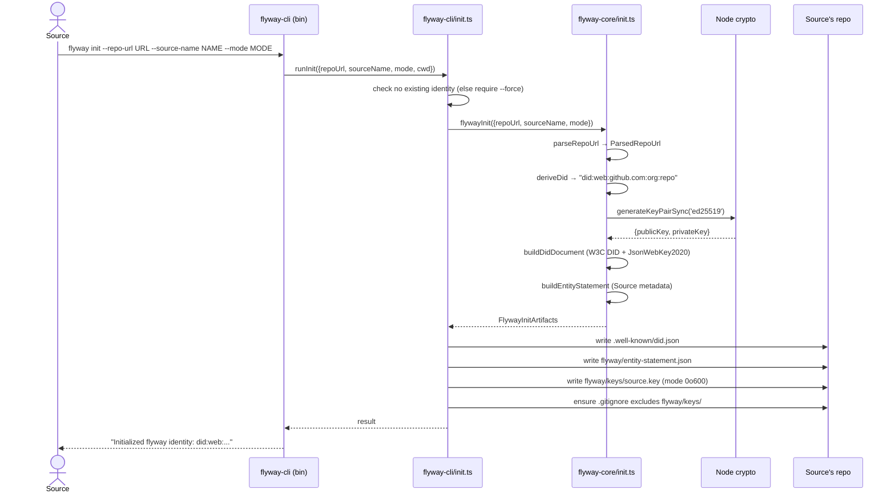
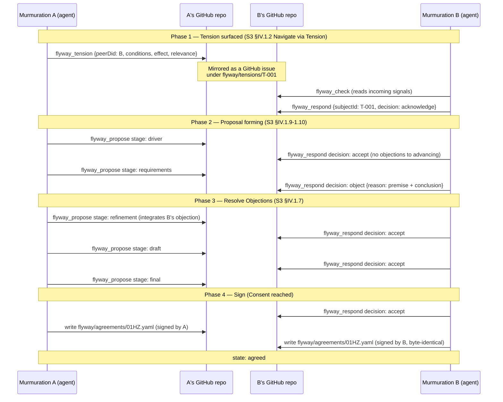
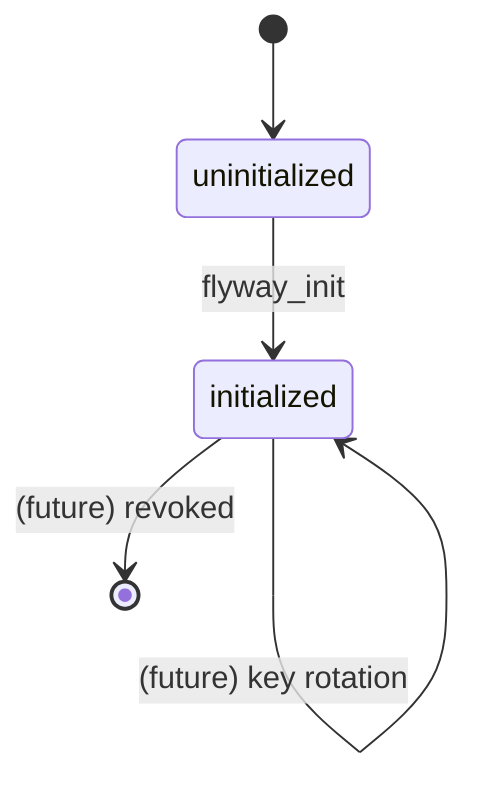
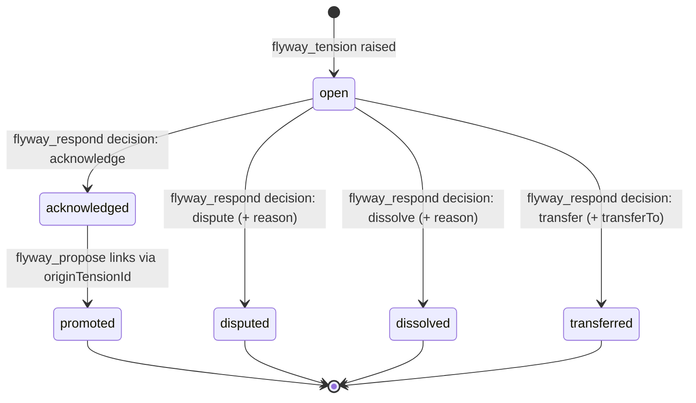
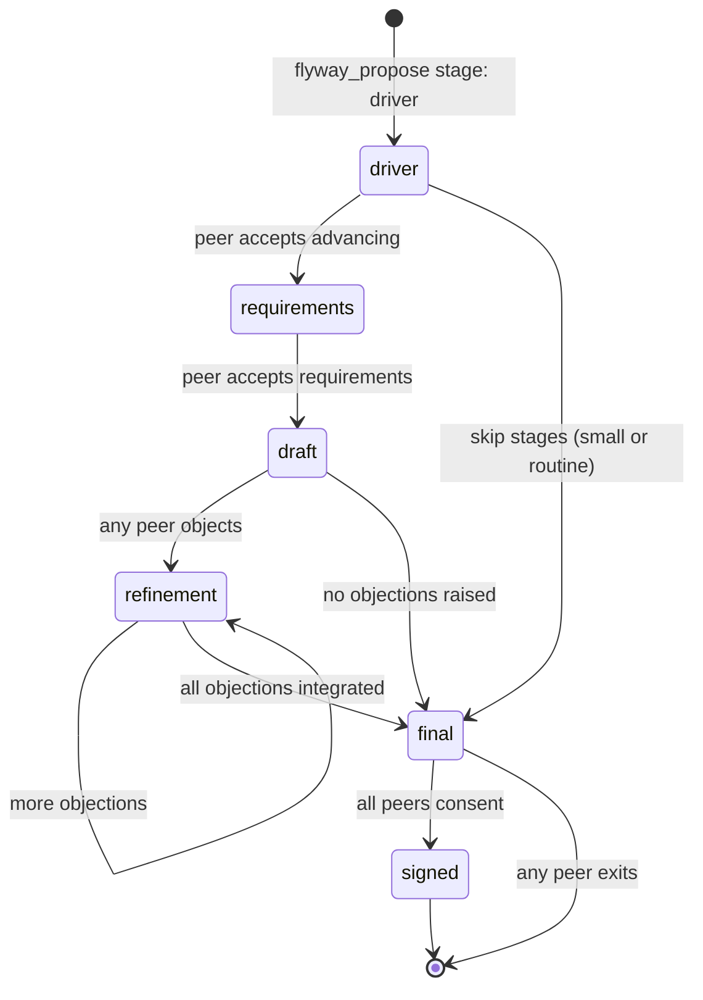
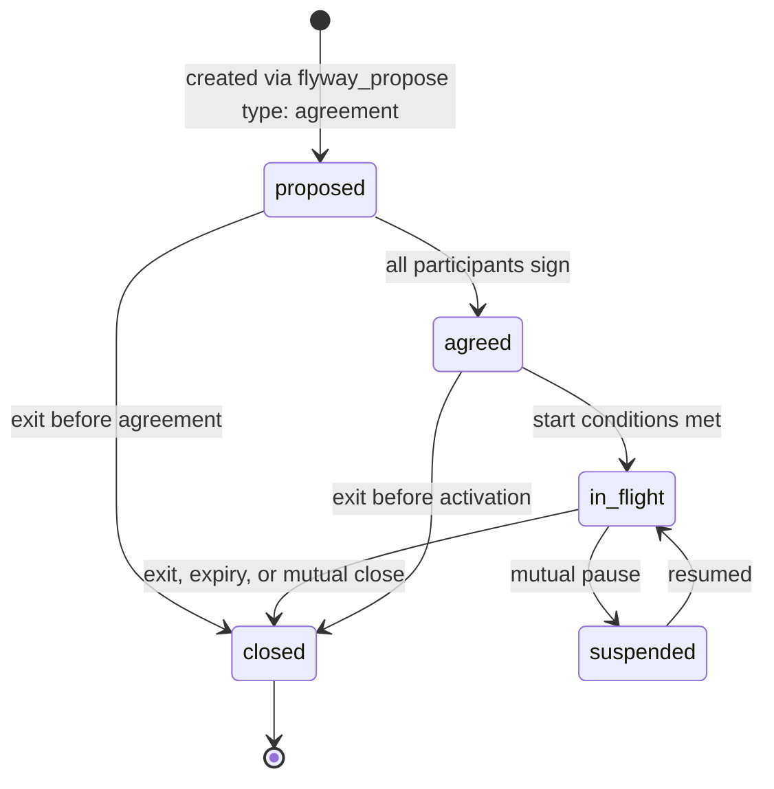

# How flyway works

A concrete walk-through of the system: components, sequence diagrams,
state machines, data flow, and contracts. Versioned against the code SHA
above; future revisions update this document and bump the SHA.

> **Reading order.** §1 gives the mental model in one page. §2 shows the
> packages and where artifacts live. §3 walks through what actually works
> today (flyway_init, skill install) with real sequence diagrams. §4
> shows the conceptual flow for cross-murmuration consent (the protocol
> surface; tool execution for it is not yet implemented). §5 covers state
> machines for the load-bearing entities. §6 lists the contracts.

---

## 1. Mental model

flyway is a **protocol for cross-murmuration collaboration**. Three layers:

1. **The substance** — Sociocracy 3.0 patterns (consent vocabulary,
   objection-vs-concern, driver/requirement/proposal stages, agreement
   structure) bundled as canonical reference and reflected in the
   typed protocol surface.
2. **The surface** — 9 typed tools (`flyway_init` … `flyway_exit`) plus
   one schema (`FLYWAY_AGREEMENT_SCHEMA`). These are the contract
   between agents and the protocol.
3. **The transport** — GitHub. Each Source's repository is the
   system-of-record for its identity, its peers, and the agreements
   it has signed. There is no central server; peers see each other
   only through committed files in each other's repos.

The agent does not "talk to flyway." The agent **loads a skill** that
teaches it the protocol's vocabulary and operations, and then it reads
and writes specific files in its Source's repo. flyway is *the
convention by which those files mean what they mean.*

---

## 2. Components

The TypeScript monorepo and the on-disk artifacts a flyway-participating
Source produces:



Key invariant: **every flyway operation either reads or writes a file
under `.well-known/` or `flyway/`.** Nothing leaves the Source's
authority except by becoming a committed artifact under that authority.

---

## 3. What works today

### 3.1 Skill installation (ADR-0006)

The Source installs the flyway skill into their agent environment. The
canonical `SKILL.md` (Agent Skills IO format) is exported by
`flyway-agent` and written to a known location by `flyway-cli`.

```mermaid
sequenceDiagram
  actor S as Source (human)
  participant CLI as flyway-cli (bin/flyway.ts)
  participant REG as SKILL_REGISTRY (cli/skill.ts)
  participant AGENT as flyway-agent (FLYWAY_SKILL_MD)
  participant FS as Filesystem

  S->>CLI: flyway skill install flyway
  CLI->>CLI: inferTarget(cwd)
  Note right of CLI: .claude/ exists?<br/>→ .claude/skills/<br/>else → ./skills/
  CLI->>REG: lookup 'flyway'
  REG->>AGENT: import FLYWAY_SKILL_MD
  AGENT-->>REG: SKILL.md content (string)
  CLI->>FS: mkdir &lt;target&gt;/flyway/
  CLI->>FS: write &lt;target&gt;/flyway/SKILL.md
  CLI-->>S: Installed flyway → &lt;target&gt;/flyway
```

After this, opening the cwd in Claude Code (or any other Agent Skills IO
client) loads the flyway skill: the agent now knows the protocol
vocabulary, the tool surface, and the consent invariants.

### 3.2 Identity issuance (`flyway_init`) — via CLI

The Source creates their flyway identity. This is a one-time operation
per Source.



After this, the Source has a cryptographic identity (did:web) and can be
discovered, recognized, and engaged with by peers.

### 3.3 Identity issuance — via MCP

The same operation, but invoked by an agent through the MCP server. The
MCP server is **stateless** — it returns the artifacts to the agent
rather than writing them. The agent decides how to persist them (often
by then running the CLI or writing the files itself).

```mermaid
sequenceDiagram
  participant A as Agent (LLM with flyway skill loaded)
  participant MCP as flyway-mcp (stdio JSON-RPC)
  participant H as handlers.ts (callFlywayTool)
  participant CORE as flyway-core/init.ts
  participant S as Source (human)

  Note over A: SKILL.md instructions tell agent<br/>how to use flyway_init
  A->>MCP: tools/call flyway_init {repoUrl, sourceName, mode}
  MCP->>H: dispatch by name
  H->>H: validate arguments
  H->>CORE: flywayInit(input)
  CORE-->>H: FlywayInitArtifacts
  H-->>MCP: {did, didDocument, entityStatement, keypair, note}
  MCP-->>A: CallToolResult (JSON)
  A->>S: surface artifacts; ask for confirmation before persisting
  Note over A,S: Agent does not write files autonomously.<br/>Source sovereignty invariant.
```

Why stateless? Because Source sovereignty says only the Source decides
what gets written under their authority. The MCP server is a *generator*
of artifacts; the act of persisting them is a Source-authorized step.

---

## 4. Cross-murmuration consent (conceptual — surface defined, execution
pending)

The largest reason flyway exists. Two or more recognized peer
murmurations negotiate an agreement through a structured consent cycle.
Tool surface is defined today; actual GitHub I/O lands in future tool
implementations.



The byte-identity of `flyway/agreements/<id>.yaml` across both repos is
what "co-signed" means. There is no authoritative copy; each repo is.

For a **trial walkthrough** of this flow (3-party plus facilitator,
producing a real consent cycle including a textbook §IV.1.6 objection and
its §IV.1.7 integration), see
[`docs/walkthroughs/2026-05-13-3party-retrospective-cadence.md`](../walkthroughs/2026-05-13-3party-retrospective-cadence.md).

---

## 5. State machines

### 5.1 Identity



### 5.2 Tension



### 5.3 Proposal (within an agreement)



Stages are **optional**: routine proposals can go straight to `final`.
Novel or high-stakes proposals walk through the earlier stages so
divergence surfaces cheaply before a fully-drafted proposal becomes hard
to revise.

### 5.4 Agreement (`FLYWAY_AGREEMENT_STATES`)



---

## 6. Contracts

### 6.1 Tool surface (9 tools)

| Tool               | Inputs (load-bearing)                                                          | Effect                                                                  |
| ------------------ | ------------------------------------------------------------------------------ | ----------------------------------------------------------------------- |
| `flyway_init`      | repoUrl, sourceName, mode                                                      | Generates DID + entity statement + ed25519 keypair (**implemented**)    |
| `flyway_status`    | (none)                                                                         | Reports current peers, agreements, open signals (not yet implemented)   |
| `flyway_discover`  | query, directoryUrl?                                                           | Looks up peers in a flyway directory (not yet implemented)              |
| `flyway_recognize` | peerDid, note?                                                                 | Proposes mutual recognition with a peer (not yet implemented)           |
| `flyway_tension`   | peerDid, conditions, effect, relevance?, proposedOwner?                        | Surfaces an S3 §IV.1.2 tension (not yet implemented)                    |
| `flyway_propose`   | peerDid, type, title, body, deadline?, stage?, previousStageId?                | Sends a directive/project/agreement at a given S3 stage (not yet impl.) |
| `flyway_respond`   | subjectId, decision, reason?, transferTo?                                      | Accepts/objects/exits a proposal or acknowledges/disputes a tension     |
| `flyway_check`     | since?, peerDid?                                                               | Reads unread incoming signals (not yet implemented)                     |
| `flyway_exit`      | target, targetType, reason?                                                    | Cleanly leaves a peer/project/syndicate (not yet implemented)           |

Schemas are exported as JSON Schema from `@murmurations-ai/flyway-core`
(`FLYWAY_TOOLS`) and as a `SKILL.md` document from
`@murmurations-ai/flyway-agent` (`FLYWAY_SKILL_MD`).

### 6.2 Agreement (`FLYWAY_AGREEMENT_SCHEMA`)

11 required fields mapped to the six S3 §IV.7.1 success criteria:

| Required field    | What it carries                                       | S3 grounding                       |
| ----------------- | ----------------------------------------------------- | ---------------------------------- |
| `id`              | Unique identifier (ULID/UUID/hash)                    | flyway bookkeeping                 |
| `schemaVersion`   | Agreement schema version                              | flyway bookkeeping                 |
| `createdAt`       | ISO 8601 datetime                                     | §IV.7.2                            |
| `participants[]`  | DIDs of Sources party to the agreement                | §IV.7.1 voluntary involvement      |
| `driver`          | {conditions, effect, relevance?}                      | §IV.1.3                            |
| `purpose`         | Intended outcome                                      | §IV.7.1 shared understanding       |
| `expectations[]`  | Per-participant commitments                           | §IV.7.1 "what is expected"         |
| `decisionRule`    | s3-consent (default) / lazy-consent / dual-source-sign / weighted-vote-bounded / apache-vote | flyway pluggability         |
| `review`          | {cadence, nextDate?, protocol?}                       | §IV.7.1 regular review meetings    |
| `exit`            | {notice, breach?, inFlightWork?}                      | §IV.7.1 termination protocol       |
| `state`           | proposed / agreed / in-flight / suspended / closed    | flyway lifecycle                   |

Plus optional `signatures[]` (required at state ≥ agreed),
`culture`, `term`, `metrics`, `disputeResolution`, `constraints`,
`concerns`. See
[`docs/concepts/agreement-template.md`](../concepts/agreement-template.md).

### 6.3 Entity statement (produced by `flyway_init`)

```typescript
interface EntityStatement {
  did: string                      // did:web:host:owner:repo
  sourceName: string               // human-readable
  mode: 'persistent' | 'interactive' | 'async' | 'ephemeral'
  flywayProtocolVersion: string    // 0.1.0
  createdAt: string                // ISO 8601
  verificationKeyId: string        // <did>#key-1
  toolsSupported: string[]         // ['flyway_init', ...]
  schemasSupported: string[]       // ['agreement@0.1.0']
}
```

### 6.4 DID document (produced by `flyway_init`)

W3C DID core + JsonWebKey2020 verification method. Resolves at
`https://<host>/<path-with-slashes>/.well-known/did.json`. For
GitHub-hosted Sources this requires GitHub Pages (or a custom resolver
that fetches raw content). DID resolution is the Source's
responsibility — the flyway protocol just writes the file.

### 6.5 Invariants (enforced by convention; future: by code)

1. **Source sovereignty.** No tool can override a Source's authority
   over what their murmuration accepts, forwards, recognizes, or
   commits to.
2. **Achieve consent; never force agreement.** The protocol's response
   cycle exists to integrate objections into a stronger proposal, not
   to bully one through.
3. **Exit follows process.** Exit is always a valid outcome, but it
   ends a good-faith consent-seeking effort — never substitutes for
   one.
4. **No proposals to unrecognized peers.** `flyway_propose` requires
   the peer to be in `flyway/peers.yaml`.
5. **Respond to everything.** Silence is not a valid protocol state.
6. **Cryptographic identity.** Every Source action that affects another
   party is (will be) signed by the Source's private key. The public
   key lives in the DID document.
7. **Append-only history.** Decisions, once made, are recorded
   immutably and replayable from each repo.

---

## 7. Reading further

- [`docs/adr/`](../adr/) — architectural decisions, in order
- [`docs/concepts/`](../concepts/) — Source, S3, consent mechanisms, agreement template, canonical S3 PDF
- [`docs/walkthroughs/`](../walkthroughs/) — protocol traces of real consent cycles
- [`docs/retrospectives/`](../retrospectives/) — honest looks at build cycles
- [`packages/core/src/`](../../packages/core/src/) — types, schemas, pure logic
- [`packages/cli/src/`](../../packages/cli/src/) — `flyway init`, `flyway skill ...`
- [`packages/mcp/src/`](../../packages/mcp/src/) — MCP server exposing the 9 tools
