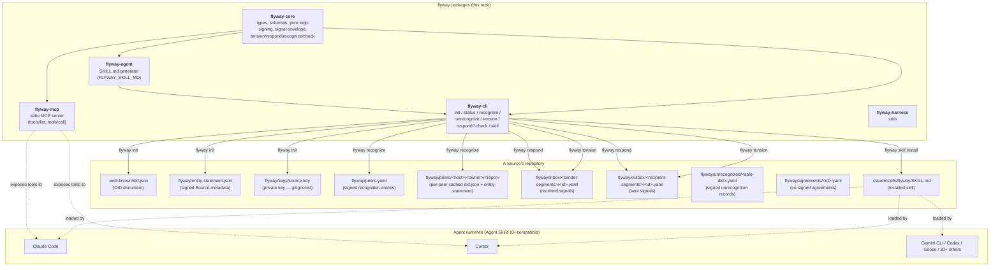
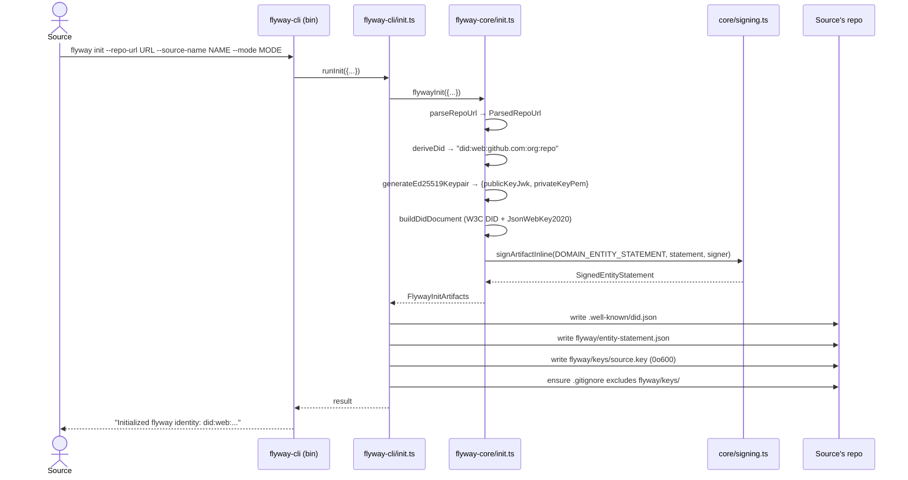
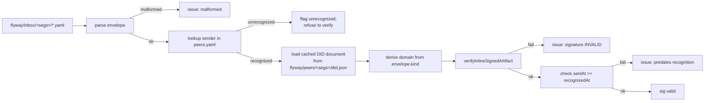
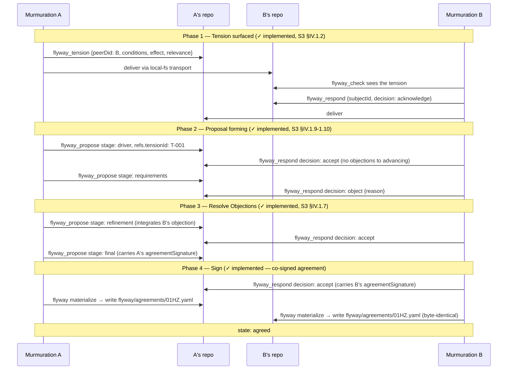
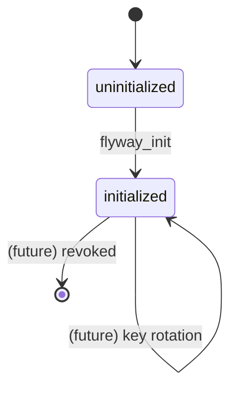
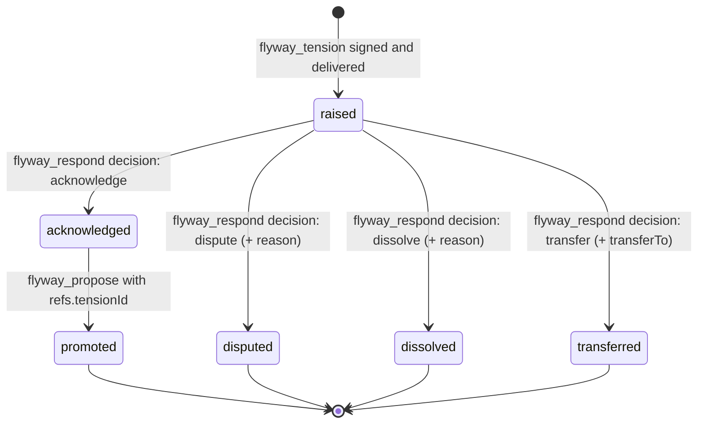
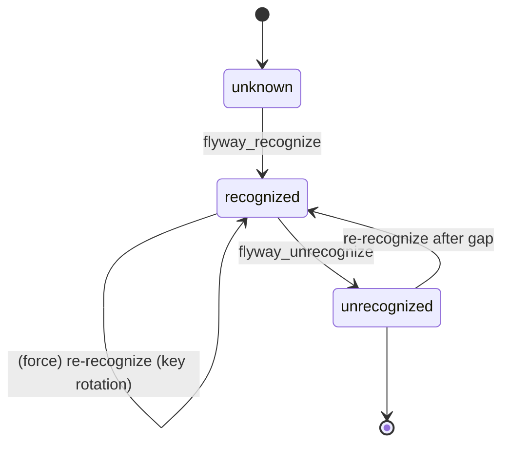
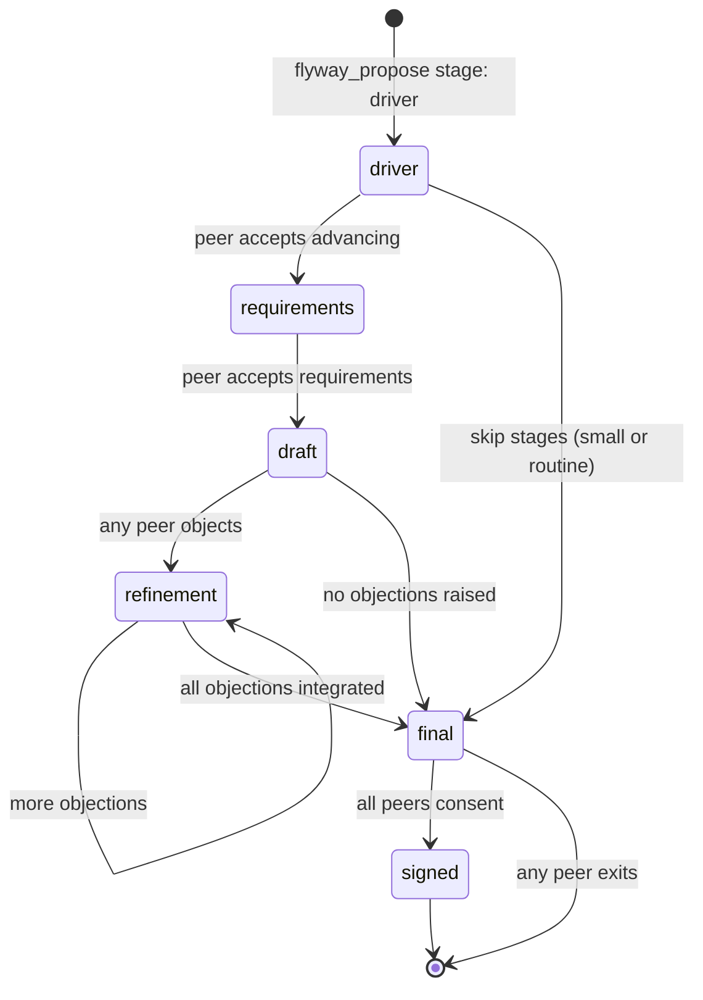
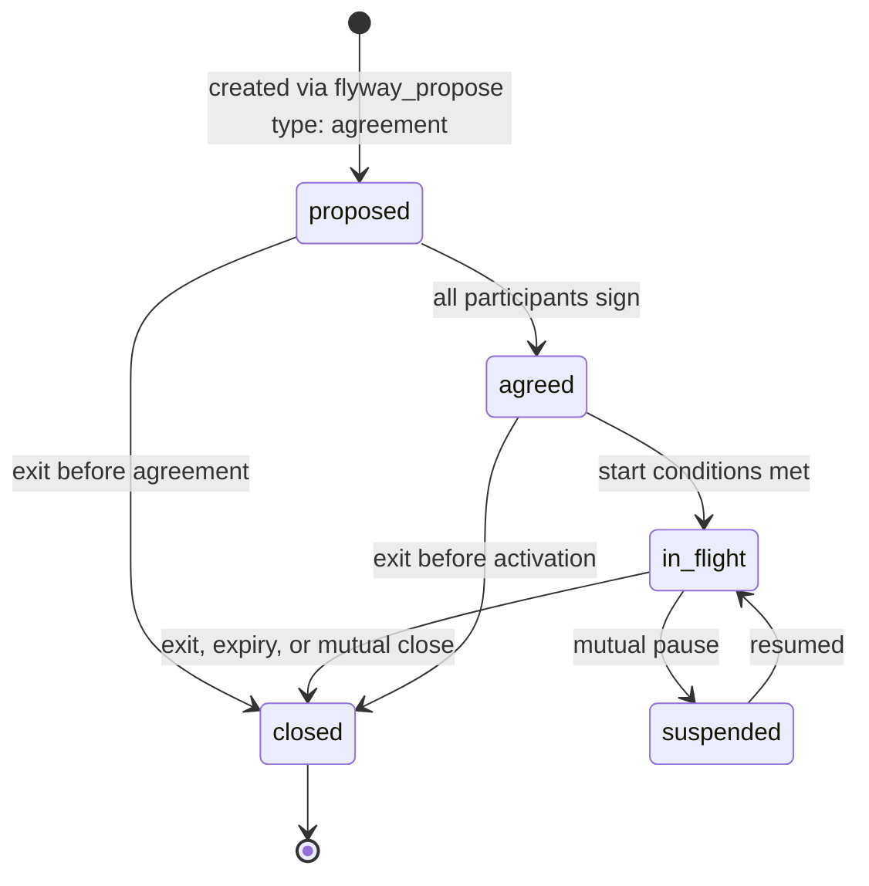

# How flyway works

A concrete walk-through of the system: components, sequence diagrams,
state machines, data flow, and contracts. Versioned against the code SHA
above; future revisions update this document and bump the SHA.

> **Reading order.** §1 gives the mental model in one page. §2 shows the
> packages and where artifacts live. §3 walks through the tools, with
> sequence diagrams — all nine are now wired. §4 covers what remains
> (reserved remote transports and lifecycle depth, not new tools). §5
> documents the cryptographic spine (signing, domain separation,
> antecedent verification). §6 covers state machines. §7 lists the
> contracts.

---

## 1. Mental model

flyway is a **protocol for cross-murmuration collaboration**. Three layers:

1. **The substance** — Sociocracy 3.0 patterns (consent vocabulary,
   objection-vs-concern, driver/requirement/proposal stages, agreement
   structure) bundled as canonical reference and reflected in the
   typed protocol surface.
2. **The surface** — 9 typed tools (`flyway_init` … `flyway_exit`) plus
   one schema (`FLYWAY_AGREEMENT_SCHEMA`). These are the contract
   between agents and the protocol.
3. **The transport** — Git repositories. Each Source's repo is the
   system-of-record for its identity, its peers, and the agreements it
   has signed. There is no central server; peers see each other only
   through committed files in each other's repos. v0.1 ships a
   local-filesystem signal transport (ADR-0008); GitHub-PR and
   URL-webhook transports are reserved.

The agent does not "talk to flyway." The agent **loads a skill** that
teaches it the protocol's vocabulary and operations, and then it reads
and writes specific files in its Source's repo. flyway is *the
convention by which those files mean what they mean.*

---

## 2. Components

The TypeScript monorepo and the on-disk artifacts a flyway-participating
Source produces:



Key invariant: **every flyway operation either reads or writes a file
under `.well-known/` or `flyway/`.** Nothing leaves the Source's
authority except by becoming a committed (or committable) artifact under
that authority.

---

## 3. What works today

Six of the nine tools run end-to-end with executable walkthroughs. The
list, in dependency order:

| # | Tool | Wired at | What it does |
| - | ---- | -------- | ------------ |
| 1 | `flyway_init` | `eec423c` | Issue a DID + signed entity statement + Ed25519 keypair |
| 2 | `flyway_status` | `02a1f09` | Read identity, peers, agreements; verify signatures |
| 3 | `flyway_recognize` (+ `unrecognize`) | `1712232` → `f9911fd` | Verify a peer; produce a signed recognition entry |
| 4 | `flyway_check` | `3ce02ec` | Read incoming signals; verify per-signal signatures |
| 5 | `flyway_tension` | `bfaf1db` | Sign + deliver an S3 tension to a recognized peer |
| 6 | `flyway_respond` | `64b112a` | Sign + deliver a tension response (acknowledge / dispute / dissolve / transfer) |

Each tool exists in *three* parity layers: pure logic in `flyway-core`,
a CLI wrapper in `flyway-cli`, a stateless MCP handler in `flyway-mcp`.
The CLI and MCP layers are interchangeable: an agent reaches the same
core via either path.

### 3.1 Skill installation (ADR-0006)

The Source installs the flyway skill into their agent environment. The
canonical `SKILL.md` (Agent Skills IO format) is exported by
`flyway-agent` and written to a known location by `flyway-cli`.

```mermaid
sequenceDiagram
  actor S as Source (human)
  participant CLI as flyway-cli (bin/flyway.ts)
  participant REG as SKILL_REGISTRY (cli/skill.ts)
  participant AGENT as flyway-agent (FLYWAY_SKILL_MD)
  participant FS as Filesystem

  S->>CLI: flyway skill install flyway
  CLI->>CLI: inferTarget(cwd)
  Note right of CLI: .claude/ exists?<br/>→ .claude/skills/<br/>else → ./skills/
  CLI->>REG: lookup 'flyway'
  REG->>AGENT: import FLYWAY_SKILL_MD
  AGENT-->>REG: SKILL.md content (string)
  CLI->>FS: mkdir &lt;target&gt;/flyway/
  CLI->>FS: write &lt;target&gt;/flyway/SKILL.md
  CLI-->>S: Installed flyway → &lt;target&gt;/flyway
```

After this, opening the cwd in Claude Code (or any other Agent Skills IO
client) loads the flyway skill: the agent now knows the protocol
vocabulary, the tool surface, and the consent invariants.

### 3.2 Identity issuance (`flyway_init`) — via CLI

The Source creates their flyway identity. One-time per Source.



After this, the Source has a cryptographic identity and a self-attested
entity statement. The MCP path is structurally identical but stateless —
core returns the artifacts; the caller persists them.

### 3.3 Recognition (`flyway_recognize`)

A unilateral, signed attestation: Source A says "I have verified Source
B's identity and am willing to engage with them." There is no "mutual"
recognition envelope; mutual recognition means each Source independently
produces their own signed entry.

```mermaid
sequenceDiagram
  actor A as Source A
  participant ACLI as flyway-cli (A)
  participant CORE as flyway-core/recognize.ts
  participant BFS as B's repo (local path)
  participant AFS as A's repo

  A->>ACLI: flyway recognize <B's path> [--note ...]
  ACLI->>BFS: read .well-known/did.json
  ACLI->>BFS: read flyway/entity-statement.json
  ACLI->>CORE: recognizePeer({peerDidDocument, peerEntityStatement, recognizedByDid, signer})
  CORE->>CORE: verify peer entity statement signature
  CORE->>CORE: refuse if self-recognition or DID mismatch
  CORE->>CORE: compute entityStatementFingerprint (sha256)
  CORE->>CORE: bind peer's verificationKey inline (G1 fix)
  CORE->>CORE: sign entry under DOMAIN_RECOGNITION
  CORE-->>ACLI: SignedRecognitionEntry
  ACLI->>AFS: append to flyway/peers.yaml
  ACLI->>AFS: cache B's did.json + entity-statement at flyway/peers/&lt;segs&gt;/
  ACLI-->>A: "Recognized did:web:..."
```

The peer's verification key is **inlined** into the recognition entry
(`peerPublicKey`, `peerVerificationKeyId`). This means a later key
rotation is detectable from the entry alone, without re-fetching the
peer's DID document.

`flyway unrecognize <peer-did>` is the inverse: produces a signed
`UnrecognitionRecord` under `flyway/unrecognized/` and removes the entry
from `peers.yaml`. The peer cache is retained for audit.

### 3.4 Signal transport (ADR-0008)

Every cross-murmuration message is a **signed signal envelope** sitting
on disk. v0.1 ships a single transport (local-fs); ADR-0008 reserves
slots for GitHub-PR and URL-webhook.

```
type SignalKind = 'tension' | 'proposal' | 'respond' | 'exit'

SignalEnvelope {
  schema: 'flyway-signal-v0'
  id        // sender-unique, time-sortable
  from, to  // DIDs
  sentAt    // RFC 3339
  kind      // SignalKind
  body      // kind-specific payload
  refs?     // {inReplyTo?, tensionId?, proposalId?}
}
SignedSignalEnvelope = SignalEnvelope & { signature: SignatureEnvelope }
```

The envelope is signed under a **kind-specific domain tag**
(`DOMAIN_TENSION`, `DOMAIN_PROPOSAL`, `DOMAIN_RESPOND`, `DOMAIN_EXIT`)
so a signature over one kind cannot be replayed as another. Mutating
`kind` after signing invalidates the signature; the verifier reads
`kind` from the signed envelope and derives the expected domain.

```
sender repo:
  flyway/outbox/<host>/<owner>/<repo>/<id>.yaml   # sent to this DID

recipient repo:
  flyway/inbox/<host>/<owner>/<repo>/<id>.yaml    # received from this DID
```

The sender always writes to their own outbox **first** (durable record
of the act), then attempts delivery to the recipient's inbox via the
chosen transport. Idempotency: re-delivering the same `(from, id)` is a
no-op; a different signature with the same id is refused with an
explicit error (`flag: 'wx'` enforces atomicity at the write).

### 3.5 First sender — `flyway_tension`

S3 §IV.1.2 "Navigate via Tension." A Source surfaces a situation worth
shared attention, before any proposal is on the table.

```mermaid
sequenceDiagram
  actor A as Source A
  participant ACLI as flyway-cli (A)
  participant CORE as flyway-core/tension.ts
  participant AFS as A's repo
  participant BFS as B's repo (local path)

  A->>ACLI: flyway tension <B's path> --conditions "..." --effect "..."
  ACLI->>AFS: read own identity (.well-known/did.json, entity-statement, keys)
  ACLI->>BFS: read .well-known/did.json (discover B's DID)
  ACLI->>AFS: check B is in flyway/peers.yaml (trust gate)
  ACLI->>CORE: createTension({from, to, body, signer, refs?})
  CORE->>CORE: validate conditions/effect non-empty
  CORE->>CORE: build envelope; sign under DOMAIN_TENSION
  CORE-->>ACLI: SignedSignalEnvelope
  ACLI->>AFS: writeSignalToOutbox (durable record)
  ACLI->>BFS: writeSignalToInbox (local-fs delivery)
  ACLI-->>A: "Flagged tension to did:web:..."
```

What `flyway_check` sees on B's side: a `tension` signal in
`flyway/inbox/<A-segments>/<id>.yaml`. It looks up A in `peers.yaml`,
loads A's DID document from the recognition-time cache, and verifies
the signature against it.

### 3.6 First dialogue — `flyway_respond` (tensions only)

The reply path. B reads A's tension and signs back `acknowledge`,
`dispute`, `dissolve`, or `transfer`.

```mermaid
sequenceDiagram
  actor B as Source B
  participant BCLI as flyway-cli (B)
  participant CORE as flyway-core/respond.ts
  participant BFS as B's repo
  participant AFS as A's repo (local path)

  B->>BCLI: flyway respond <A's path> --subject-id ID --decision DEC [--reason ...]
  BCLI->>BFS: read own identity
  BCLI->>AFS: read .well-known/did.json (discover A's DID)
  BCLI->>BFS: check A is in flyway/peers.yaml (trust gate)
  BCLI->>BFS: load A's cached did.json (ADR-0009 — not from AFS!)
  BCLI->>BFS: findInboxSignalById(B, subjectId) — locate the subject
  BCLI->>BCLI: refuse if subject.from != A's DID
  BCLI->>BCLI: refuse if subject.kind != 'tension' (v0.1)
  BCLI->>CORE: createTensionResponse({from, to, body, refs, subjectEnvelope, subjectSenderDidDocument, signer})
  Note right of CORE: ADR-0009 antecedent verification:<br/>kind / id / sender / DID-doc<br/>binding / signature
  CORE->>CORE: build envelope; sign under DOMAIN_RESPOND
  CORE-->>BCLI: SignedSignalEnvelope
  BCLI->>BFS: writeSignalToOutbox
  BCLI->>AFS: writeSignalToInbox
  BCLI-->>B: "Responded to tension <id> from <A's DID>"
```

What A sees: a `respond` signal in
`flyway/inbox/<B-segments>/<id>.yaml`. Its `refs.tensionId` matches A's
original tension id (part of the signed payload — re-pointing breaks the
signature). A's `flyway_check` verifies B's signature against B's
cached did.json.

After this round-trip, **both sides hold complete signed records**:

| Side | `flyway/outbox/...` | `flyway/inbox/...`        |
| ---- | ------------------- | ------------------------- |
| A    | the tension         | the acknowledge           |
| B    | the acknowledge     | the tension               |

Neither side holds canonical state about the other. Both can audit the
exchange against artifacts they themselves signed or attested to at
recognition time.

### 3.7 Reading the inbox — `flyway_check`

Transport-agnostic. Reads whatever is in `flyway/inbox/<segments>/*.yaml`
and reports per-signal status.



Per-signal output: envelope, path, `fromRecognized`, `signatureValid`,
`fromPathMatchesEnvelope`, `issues[]`. A signal is counted in
`validCount` only if it is recognized, signature-valid, AND has no
issues — so the recognition-window-ordering check (SEC-3 from the
2026-05-25 security review) excludes a signal from the valid count
even if its signature itself is fine.

---

## 4. What's pending

**All nine tools are wired.** The protocol surface is complete: discovery,
identity, recognition, the tension dialogue, the full proposal-forming
consent cycle, co-signed-agreement materialization, and clean exit all run
end-to-end. What remains is depth and reach, not new tools:

| Area | What it adds | Status |
| ---- | ------------ | ------ |
| Remote transports (v0.2) | http(s) directory fetch for `flyway_discover`; GitHub-PR / URL signal transport (ADR-0008) | Reserved seam — the shapes are defined; local-fs ships today |
| Exit-aware reads | `flyway_status` / `flyway_check` interpret exit records and surface a relationship or agreement as closed | Not yet modelled |
| Agreement lifecycle | `in_flight` / `suspended` transitions past `agreed` | Not yet modelled |

A few tools are subtler than "wired" conveys:

- `flyway_discover` is the one *pre-trust* tool — directory entries are
  informational pointers, not attestations, so it signs and verifies
  nothing. The trust step is `flyway_recognize`, which fetches the
  candidate's own signed artifacts and verifies them. v0.1 reads a local
  directory file; remote fetch is the reserved seam above.
- `flyway_exit` is a *unilateral* signed notice — always valid, no peer can
  prevent it — delivered like any signal under `DOMAIN_EXIT`. It is distinct
  from `flyway_unrecognize` (exit ends joint commitments; it does not
  retract the recognition attestation) and it never mutates a co-signed
  agreement file (the agreement is immutable; exit is a superseding record).
- Agreement **materialization** (`flyway materialize`) — turning an accepted
  final-stage agreement proposal into the co-signed
  `flyway/agreements/<id>.yaml` — is a *local act*, not a protocol signal, so
  it is not counted among the nine wire tools even though it is wired.

Sequence diagram for the full cross-murmuration consent flow (all phases
now implemented; see the Tier 4 walkthrough for a verbatim transcript):



The byte-identity of `flyway/agreements/<id>.yaml` across both repos is
what "co-signed" means. There is no authoritative copy; each repo is.

The Tier 3 walkthrough
([2026-05-25-tier3-signal-dialogue.md](../walkthroughs/2026-05-25-tier3-signal-dialogue.md))
exercises Phase 1 end-to-end with real signatures; the Tier 4 walkthrough
([2026-06-12-tier4-cosigned-agreement.md](../walkthroughs/2026-06-12-tier4-cosigned-agreement.md))
exercises the Phase 4 close — proposal → accept → two independent
materializations to a byte-identical agreement — with real signatures and a
matching SHA-256.

---

## 5. Cryptographic spine

### 5.1 Signing primitives (ADR-0007)

Every signed artifact uses the same `Signer` interface:

```typescript
interface Signer {
  readonly id: string                // e.g. 'local-ed25519:did:web:.../#key-1'
  readonly verificationKeyId: string // 'did:web:...#key-1'
  readonly publicKeyJwk: PublicKeyJwk
  sign(bytes: Uint8Array): Promise<Uint8Array>
}
```

v0.1 ships one implementation (`localEd25519Signer`). ADR-0007 reserves
the seam for future `cardanoHotSigner`, `kmsSigner`, etc. — they drop
in without touching artifact-producing code.

Every signature is wrapped in an envelope carrying its verification
metadata:

```typescript
interface SignatureEnvelope {
  verificationKeyId: string
  algorithm: 'EdDSA'
  canonicalization: 'flyway-jcs-v1'
  domain: string                     // kind-specific; see §5.2
  signature: string                  // base64url
}
```

### 5.2 Domain separation

Each artifact kind has a distinct domain tag. A signature over one kind
cannot be replayed as another:

| Domain | Used by |
| ------ | ------- |
| `flyway-v1:entity-statement` | `flywayInit` |
| `flyway-v1:recognition` | `recognizePeer` |
| `flyway-v1:unrecognition` | `unrecognizePeer` |
| `flyway-v1:tension` | `createTension` |
| `flyway-v1:proposal` | `createProposal` |
| `flyway-v1:respond` | `createTensionResponse` / `createProposalResponse` |
| `flyway-v1:exit` | `createExit` |
| `flyway-v1:agreement` | `signAgreement` (detached; co-signed agreements) |

The signed payload always includes the discriminating field (e.g.
`kind` for signals). The verifier reads that field, derives the
expected domain, and verifies. Tampering with the field after signing
invalidates the signature.

### 5.3 Canonicalization

A minimal JCS-style scheme (`flyway-jcs-v1`):

- Objects: keys sorted by UTF-16 code-unit ordering
- `undefined` values dropped (treated as "not present")
- No insignificant whitespace
- Numbers via `JSON.stringify` (RFC 8259 compatible)
- Signatures are excluded from canonicalization (chicken-and-egg)

Deterministic across implementations, environments, and serializer
versions. Tested across 8 representative cases in `signing.test.ts`.

### 5.4 Antecedent verification (ADR-0009)

A signer never signs an attestation over an unverified antecedent
artifact. This is the load-bearing rule that lets a signature chain mean
anything: if I sign over a peer's tension and my signature verifies,
that's a claim about the tension's authenticity, not just a claim about
my reply.

The rule is enforced **in core**, at the signing primitive itself —
adapters can't skip it:

- `recognizePeer(peerDidDocument, peerEntityStatement, …)` verifies
  the peer entity statement before signing the recognition entry.
- `createTensionResponse(subjectEnvelope, subjectSenderDidDocument, …)`
  verifies the subject tension before signing the response.
- `createProposal` (when promoting a tension or continuing a stage chain),
  `createProposalResponse`, and `materializeAgreement` all carry the same
  structural requirement.
- `createExit` is the deliberate exception: exit is unilateral and signs
  over no prior artifact, so there is no antecedent to verify.

**The verifying key is the recognition-time cached copy** — loaded from
`flyway/peers/<segments>/did.json`, the artifact we attested to when we
recognized the peer. Adapters MUST NOT use a freshly-read
`.well-known/did.json` from a peer-controlled path for verification.
Doing so would let an attacker who controls that path supply a matching
public key for an artifact they fabricated.

Five checks at the signing primitive, in order:

1. **Kind match.** Antecedent's `kind` matches what the primitive expects.
2. **Id match.** Reference fields (e.g. `refs.tensionId`) point at the antecedent's `id`.
3. **Sender match.** Antecedent's `from` equals the new artifact's `to`.
4. **DID-document binding.** Supplied `subjectSenderDidDocument.id` matches `antecedent.from`.
5. **Signature verification.** Antecedent verifies under the supplied DID document and its kind-specific domain.

Any failure aborts the operation; no signed artifact is produced.

### 5.5 Path-traversal safety

Peer DIDs become directory names. `peerCachePathSegments(did)` is the
single point of contact and is locked down: every segment must match
`[A-Za-z0-9._-]+` and must not equal `.` or `..`. A peer who controls
their `.well-known/did.json` can publish any DID string, but they
cannot coerce `peerCachePathSegments` into writing outside the cache
subtree.

---

## 6. State machines

### 6.1 Identity



### 6.2 Tension dialogue (✓ implemented through `acknowledged`)



### 6.3 Recognition



### 6.4 Proposal (within an agreement)



### 6.5 Agreement (`FLYWAY_AGREEMENT_STATES`)

The `proposed → agreed` transition is wired: `flyway materialize` writes
the co-signed file at `state: agreed` once both participants have signed.
`flyway_exit` delivers the signed notice that closes a relationship,
project, or agreement (as a superseding record — the agreed file itself is
immutable). The intermediate lifecycle transitions (`in_flight` /
`suspended`) are not yet modelled.



---

## 7. Contracts

### 7.1 Tool surface (9 tools)

| Tool | Inputs (load-bearing) | Effect | Wired? |
| ---- | --------------------- | ------ | ------ |
| `flyway_init` | repoUrl, sourceName, mode | Generates signed DID document + entity statement + Ed25519 keypair | ✅ |
| `flyway_status` | (none) | Reports identity, peers, agreements, signature validity, inbox issues | ✅ |
| `flyway_discover` | query?, directory | Pre-trust search of a flyway directory (free-text or exact-DID); v0.1 reads a local directory file | ✅ |
| `flyway_recognize` | peerDid, note? | Produces a signed recognition entry binding peer's key fingerprint | ✅ |
| `flyway_tension` | peerDid, conditions, effect, relevance?, proposedOwner? | Signs an S3 §IV.1.2 tension envelope; delivers to peer inbox | ✅ |
| `flyway_propose` | peerDid, type, title, body, deadline?, stage?, previousStageId? | Sends a directive / project / agreement at an S3 stage | ✅ |
| `flyway_respond` | subjectId, decision, reason?, transferTo?, concern? | Signs a response binding `refs.tensionId` (or proposalId) | ✅ |
| `flyway_check` | since?, peerDid? | Reads inbox; per-signal signature + sentAt/recognizedAt ordering | ✅ |
| `flyway_exit` | target, targetType, reason? | Cleanly leaves a peer / project / syndicate; signed, unilateral | ✅ |

Schemas are exported as JSON Schema from `@murmurations-ai/flyway-core`
(`FLYWAY_TOOLS`) and as a `SKILL.md` document from
`@murmurations-ai/flyway-agent` (`FLYWAY_SKILL_MD`).

### 7.2 Agreement (`FLYWAY_AGREEMENT_SCHEMA`)

11 required fields mapped to the six S3 §IV.7.1 success criteria:

| Required field   | What it carries                                       | S3 grounding                       |
| ---------------- | ----------------------------------------------------- | ---------------------------------- |
| `id`             | Unique identifier (ULID/UUID/hash)                    | flyway bookkeeping                 |
| `schemaVersion`  | Agreement schema version                              | flyway bookkeeping                 |
| `createdAt`      | ISO 8601 datetime                                     | §IV.7.2                            |
| `participants[]` | DIDs of Sources party to the agreement                | §IV.7.1 voluntary involvement      |
| `driver`         | {conditions, effect, relevance?}                      | §IV.1.3                            |
| `purpose`        | Intended outcome                                      | §IV.7.1 shared understanding       |
| `expectations[]` | Per-participant commitments                           | §IV.7.1 "what is expected"         |
| `decisionRule`   | s3-consent / lazy-consent / dual-source-sign / weighted-vote-bounded / apache-vote | flyway pluggability |
| `review`         | {cadence, nextDate?, protocol?}                       | §IV.7.1 regular review meetings    |
| `exit`           | {notice, breach?, inFlightWork?}                      | §IV.7.1 termination protocol       |
| `state`          | proposed / agreed / in-flight / suspended / closed    | flyway lifecycle                   |

Plus optional `signatures[]` (required at state ≥ agreed), `culture`,
`term`, `metrics`, `disputeResolution`, `constraints`, `concerns`. See
[`docs/concepts/agreement-template.md`](../concepts/agreement-template.md).

### 7.3 Entity statement (produced by `flyway_init`)

```typescript
interface EntityStatement {
  did: string                      // did:web:host:owner:repo
  sourceName: string               // human-readable
  mode: 'persistent' | 'interactive' | 'async' | 'ephemeral'
  flywayProtocolVersion: string    // 0.1.0
  createdAt: string                // ISO 8601
  verificationKeyId: string        // <did>#key-1
  toolsSupported: string[]         // ['flyway_init', ...]
  schemasSupported: string[]       // ['agreement@0.1.0']
}
// Signed inline under DOMAIN_ENTITY_STATEMENT.
```

### 7.4 Recognition entry (produced by `flyway_recognize`)

```typescript
interface RecognitionEntry {
  did: string                                // peer's DID
  sourceName: string
  mode: string
  peerVerificationKeyId: string              // bound inline (G1)
  peerPublicKey: PublicKeyJwk                // bound inline (G1)
  entityStatementFingerprint: string         // sha256 of canonical bytes
  recognizedAt: string                       // ISO 8601
  recognizedBy: string                       // recognizer's DID
  note?: string
}
// Signed inline under DOMAIN_RECOGNITION by the recognizer.
```

### 7.5 Signal envelope (produced by senders)

See §3.4. The envelope itself is `kind`-agnostic; bodies vary:

```typescript
interface TensionBody {
  conditions: string
  effect: string
  relevance?: string
  proposedOwner?: string
}

interface TensionResponseBody {
  decision: 'acknowledge' | 'dispute' | 'dissolve' | 'transfer'
  reason?: string       // required for dispute/dissolve/transfer
  transferTo?: string   // required for transfer
}
```

### 7.6 DID document (produced by `flyway_init`)

W3C DID core + JsonWebKey2020 verification method. Resolves at
`https://<host>/<path-with-slashes>/.well-known/did.json`. For
GitHub-hosted Sources this requires GitHub Pages (or a custom resolver
that fetches raw content). DID resolution is the Source's
responsibility — the flyway protocol just writes the file.

### 7.7 Invariants

1. **Source sovereignty.** No tool can override a Source's authority
   over what their murmuration accepts, forwards, recognizes, or
   commits to.
2. **Achieve consent; never force agreement.** The protocol's response
   cycle exists to integrate objections into a stronger proposal, not
   to bully one through.
3. **Exit follows process.** Exit is always a valid outcome, but it
   ends a good-faith consent-seeking effort — never substitutes for one.
4. **No signals to unrecognized peers.** `flyway_tension` and
   `flyway_respond` refuse to send to a peer not in `peers.yaml`.
   Recognition is the trust gate.
5. **Respond to everything.** Silence is not a valid protocol state.
6. **Cryptographic identity.** Every Source action that affects another
   party is signed by the Source's private key under the kind-specific
   domain. Domain separation prevents cross-kind replay.
7. **Antecedent verification.** A signer never signs over an unverified
   antecedent artifact (ADR-0009). Verifying keys come from the
   recognition-time cache, not from peer-controlled paths.
8. **Append-only history.** Decisions, once made, are recorded
   immutably and replayable from each repo.

---

## 8. Reading further

- [`docs/status.md`](../status.md) — current status snapshot with tool maturity, milestone timeline, open issues
- [`docs/status.html`](../status.html) — visual companion
- [`docs/adr/`](../adr/) — architectural decisions in order (9 accepted)
- [`docs/walkthroughs/`](../walkthroughs/) — protocol traces with verbatim transcripts
- [`docs/concepts/`](../concepts/) — Source, S3, consent mechanisms, agreement template, canonical S3 PDF
- [`docs/retrospectives/`](../retrospectives/) — honest looks at build cycles
- [`packages/core/src/`](../../packages/core/src/) — types, schemas, pure logic, signing
- [`packages/cli/src/`](../../packages/cli/src/) — `flyway init/status/recognize/unrecognize/tension/respond/check/skill`
- [`packages/mcp/src/`](../../packages/mcp/src/) — MCP server exposing the 9 tools
